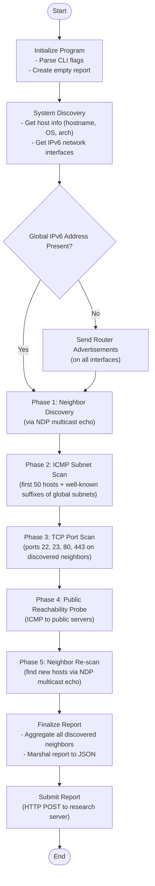

# Recon6 — an IPv6 Sandbox Capability Probe

> Presented at **DIMVA 2026** · [recon6.r3search.net](https://recon6.r3search.net/) — for the paper, results, and data please have a look on the project page.

**Recon6** is an active network discovery tool that probes sandbox environments for IPv6 capabilities. It employs active stimulation techniques to identify live hosts, enumerate interfaces, and map neighbor relationships that would be invisible to passive monitoring. **Recon4** is included as a reference probe — it applies the same methodology over IPv4 to establish a baseline for comparison.



see  for its generated traffic

see `yara`folder for some example yara rules

## Overview

These tools are designed to mimic lateral movement and discovery phases of a network assessment.

### Recon6 (IPv6)
*   **Interface Enumeration:** Identifies local IPv6 interfaces and prefixes.
*   **Rogue Router Advertisement (RA):** Injects unsolicited RAs (prefix `2001:db8:666::/64`) to trigger Stateless Address Autoconfiguration (SLAAC) and Duplicate Address Detection (DAD) on silent hosts, revealing their presence.
*   **Multicast NDP Discovery:** Sends ICMPv6 Echo Requests to the link-local "All Nodes" multicast address (`ff02::1`).
*   **Heuristic Subnet Scanning:** Probes likely addresses within discovered subnets.
*   **Port Scanning:** Checks common TCP ports (22, 23, 80, 443) on discovered neighbors.

### Recon4 (IPv4)
*   **Interface Enumeration:** Identifies local IPv4 interfaces and subnets.
*   **Broadcast Ping:** Sends ICMP Echo Requests to the subnet broadcast address to elicit replies from legacy or misconfigured stacks ("ARP-like" discovery at Layer 3).
*   **Subnet Scanning:** Systematically pings addresses within local private subnets.
*   **Port Scanning:** Checks common TCP ports on discovered neighbors.

## Safety Warning

**⚠️ DANGER: DO NOT RUN ON PRODUCTION NETWORKS**

These tools open raw sockets (`CAP_NET_RAW` or root required) and inject network control traffic (Router Advertisements, Broadcast Pings). This can cause network disruption, trigger IDS/IPS alarms, or violate network usage policies.

**Use only in authorized, isolated testing environments.**

## Building

```bash
go build recon6.go
go build recon4.go
```
or simple
```
make all
```

to create a specific probe version use `make PROBE=123` which outs to to dist/probe/123/.


## Usage

```bash
sudo ./recon6 -v    # Verbose mode
sudo ./recon4 -vv   # Very verbose mode
```

## License

MIT — see [LICENSE](LICENSE).
